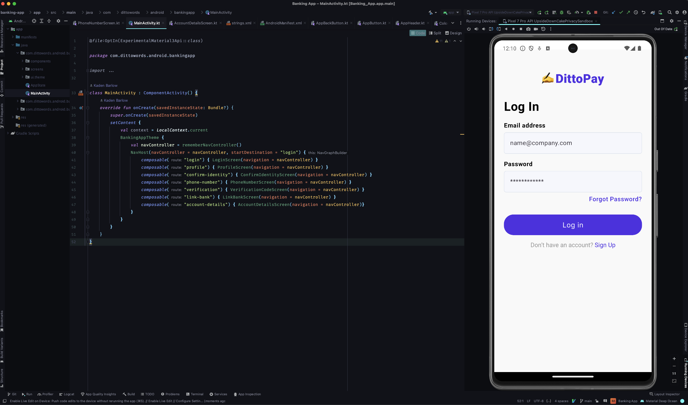

# DittoPay — Android Demo App

DittoPay is a small Android app that corresponds with the sample project in your workspace. With this sample app, you can set up our [developer integrations](https://developer.dittowords.com) to sync text edits in just a few minutes.

We also use the sample app to showcase how you can use Ditto’s developer integrations in an Android environment for: 

- Handling plurals
- Translation/localization with Variants
- Componentization
- Variable interpolation

 

## 1. Running the App 🛠

To run the sample app locally: 

1. Clone this repository
2. Open the DittoPay project in Android Studio
3. Click the `Sync files with Gradle` button
4. Select the app configuration and press the Run button to boot the DittoPay app onto your emulator

## 2. Setting up the Ditto CLI 🤖

This repo is already set up with the string files and string IDs of the sample project in your workspace, as well as a [config for the CLI](https://github.com/dittowords/ditto-android-demo/blob/master/ditto/config.yml) to sync text from the DittoPay sample components for Android. 

This means all you have to do is install and authenticate to the CLI to have things be hooked up from end-to-end:

1. **Install the CLI:** In the root of the repository, run `npm install`. This will install all dependencies recorded in the [package.json](./package.json) file, where the latest version of the Ditto CLI is listed.
2. **To authenticate, run the CLI:**
    
    `npx @dittowords/cli pull`
    
    In this project, we’ve set up a simple [NPM script](https://docs.npmjs.com/cli/v10/using-npm/scripts) to enable using the Ditto CLI from any subdirectory, which you can view in the `scripts` property of the [package.json](./package.json) file. 
    
    You can always run the CLI directly using `npx` (see CLI docs[LINK]), but this setup is reliable and is similar to one you might want in your own production environment. 
    
    You’ll be prompted to provide your API key if it’s your first time running the CLI.
    

Note: you can view the CLI config at `/ditto/config.yml`:

```yaml
sources:
  components: 
    folders:
      - id: sample-components
        name: Sample Components
variants: true
format: android
```

## 3. Syncing Edits ✍️

1. Make edits to [DittoPay text in Ditto](https://app.dittowords.com/projects/sample). You can make edits to the components connected in the DittoPay sample project itself, or to the sample components directly! 
2. Pull in the latest edits via the Ditto CLI: 

    ```bash
    # Run `npx @dittowords/cli pull` and copy strings into app/src/main/res/values/strings.xml and app/src/main/res/values-pt/strings.xml or run
    npm run ditto:pull
    ```

3. Rebuild the application to pull in the latest string changes

## Feature Requests and Support

Is there another library/framework that you think we should create a demo for? 

Is there a Ditto feature you want an example for in Android? 

Please let us know by [opening an issue](https://github.com/dittowords/ditto-android-demo/issues) or sending us an email!
